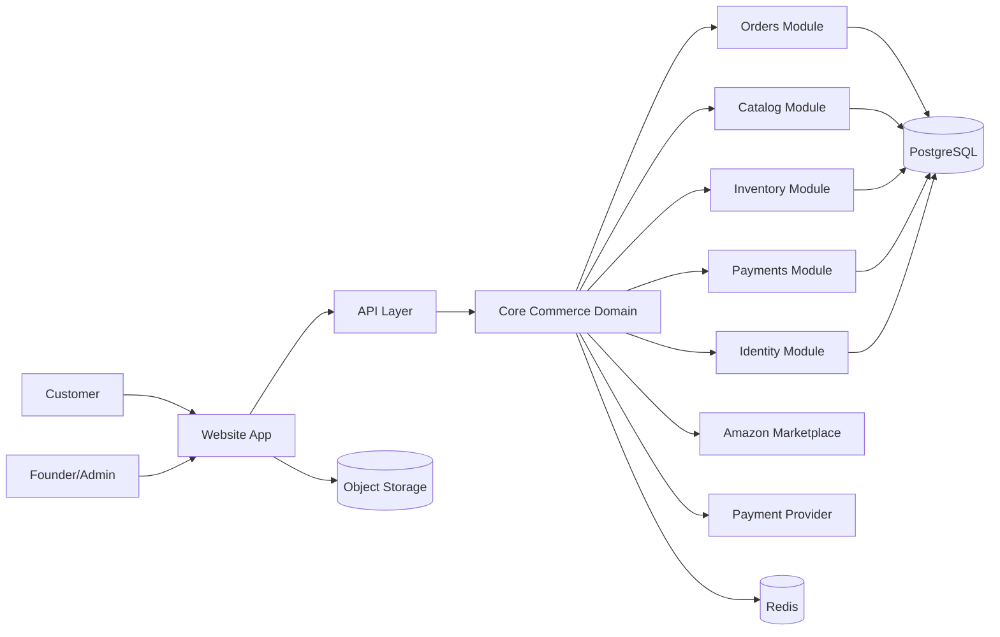
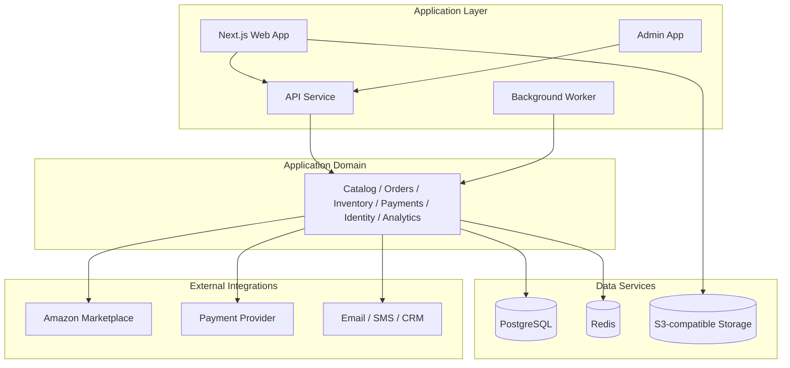

# Architecture Overview

## Purpose
This repository establishes the engineering foundation for a premium consumer brand platform that sells through Amazon and its own direct-to-consumer website. The architecture is intentionally designed as a modular monolith with explicit boundaries so the system can evolve into a larger commerce platform without a disruptive rewrite.

## Design Principles
- domain-first design rather than channel-first design
- modular monolith as launch architecture
- isolation of external systems behind adapters
- strong typing and configuration-driven setup
- production-ready security, observability, and testing from day one
- startup-friendly operational model

## Context Diagram

## Container View

## Component Boundaries
### Core Modules
- identity
- catalog
- products
- cart
- checkout
- orders
- payments
- customers
- inventory
- fulfillment
- marketing
- reviews
- content
- notifications
- analytics
- marketplaces
- amazon
- admin
- audit
- configuration

### Design Rules
- no arbitrary cross-module database access
- domain services coordinate use cases
- infrastructure concerns are isolated behind service interfaces
- market-specific logic remains behind adapters

## Data Flow
1. Storefront requests are handled by the web or API layer.
2. Use cases coordinate domain services and validation.
3. Infrastructure services persist state in PostgreSQL and read/write caches as needed.
4. Domain events are emitted for workflow integration, analytics, and marketplace synchronization.
5. A background worker handles asynchronous tasks like email, external sync, and queue-driven order processing.

## Security Boundaries
- public storefront and admin interfaces are separated by route and role boundaries
- customer PII is minimized and handled under explicit policies
- payment provider is treated as an external trust boundary
- secrets are never stored in repo or container image
- audit events record sensitive business actions

## External Integrations
- Amazon Seller via adapter interface
- payment provider via backend provider abstraction
- object storage for media assets
- email / SMS / CRM integration via notifications module
- analytics provider abstraction for events and dashboards

## Deployment Architecture
Initial production recommendation:
- AWS-hosted managed PostgreSQL
- S3-compatible object storage for assets
- Redis for cache and background coordination
- web frontend deployed to a managed platform or containerized service
- API and workers deployed as containers
- CDN for static assets and media
- managed monitoring and logs

This is a practical MVP architecture that supports future Kubernetes and microservice extraction if needed.

## Disaster Recovery Strategy
- source-controlled infrastructure and schema migrations
- nightly or scheduled database backups
- point-in-time recovery if supported by the database platform
- object storage versioning and retention
- environment separation for dev, staging, and production
- rollback plan for each deployment
- clear owner assignment for secrets and infrastructure

## Key Architectural Decisions
1. Use a modular monolith rather than a distributed architecture for the initial launch.
2. Build the core business domain around Brand → Product → Customer → Order → Payment → Fulfillment → Marketing → Analytics.
3. Put Amazon and other marketplaces behind anti-corruption adapters.
4. Keep the initial system simple operationally and cost-aware.
5. Treat observability, security, and testing as first-class platform concerns.

## Open Technical Decisions
TODO: ARCHITECTURE DECISION REQUIRED
- whether to choose Next.js backend or NestJS API for the backend layer
- whether to standardize on Prisma or Drizzle
- whether the MVP should use a managed PostgreSQL instance or self-hosted containers locally
- whether to deploy first on ECS/Fargate, App Runner, or a managed Kubernetes platform
- whether to use a single app repo or split web/admin/api later

## Documentation Expectations
This architecture is a baseline only and must be updated when product, cloud, or business requirements change.
